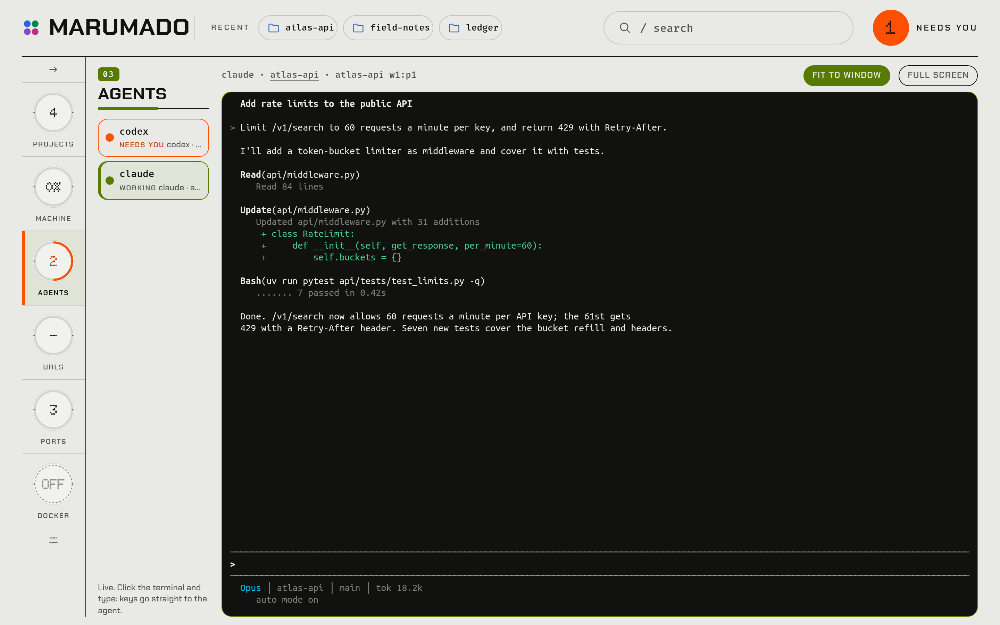

# Marumado

One hub for every project on this machine, and for the machine itself.



- **Projects**: every subfolder of your scan folders is a project, with its stack, git branch, last commit, repo and live URLs detected. Scan folders come from `MARUMADO_PROJECT_DIRS` in `.env` (comma separated, default `/projects`) plus any you add in the app (**Projects → Folders**). Add projects by hand too; fields you edit by hand survive rescans.
- **Machine**: CPU, memory, disks, network, and sensors, with about 30 minutes of history.
- **URLs**: every live and local URL is checked every minute, with up/down status and response time. **Add URL** watches any site or service that isn't a project.
- **Ports**: what is listening, and which project it belongs to.
- **Docker**: containers, start/stop/restart, and logs.
- **Processes**: search, sort, and stop (with confirmation).
- **Momentum**: how each project is moving, from 12 weeks of git history (moving, slowing, stalled). Mark projects *push* or *park*, or archive them; a pushed project with no commit for 14 days shows up under "needs you". Projects are rescanned every hour. A heatmap shows every project's last 12 weeks on one screen.
- **Skills**: a skill map built from project stacks and libraries (React, Django REST, Three.js…), with how recently each was used (active, cooling, rusty). Add skills you want to learn, mark ones to grow, hide ones that aren't skills, and keep notes. Shown as a grid of cards or a list.
- **Agents**: the coding agents running in [Herdr](https://herdr.dev), with their state and a live terminal you can watch and type into from the browser, including from your phone. Point `MARUMADO_HERDR_*` in `.env` at wherever Herdr runs (this machine, a VM or over SSH); `MARUMADO_HERDR_TERMINAL` sets whether the browser can type (`control`), only watch (`observe`) or neither (`off`).


Press `/` (or ⌘K / Ctrl+K) anywhere to search projects, processes, ports, and containers. **Arrange** chooses which modules sit on the home panel.

## Run it with Docker (recommended)

```sh
make up        # creates .env on first run, builds, starts → http://127.0.0.1:7878
make logs      # follow logs
make down      # stop
make           # every shortcut
```

The container shares the host's process and network namespaces (`pid: host`, `network_mode: host`) and reads `/var/run/docker.sock`, so it monitors the real machine rather than itself. This needs a **Linux host**; under Docker Desktop it would monitor Docker's VM instead.

### Project folders

The container only sees folders mounted into it. `make up` generates `compose.override.yaml` with a read-only mount (at the same path) for every folder in `MARUMADO_PROJECT_DIRS` and `MARUMADO_MOUNTS`:

```sh
MARUMADO_PROJECT_DIRS=/projects,/home/me/code   # scanned
MARUMADO_MOUNTS=/home/me                        # visible only, so folders inside can be added in the app
```

After changing them, run `make up` (or `make restart`).

### Opening it to your phone or teammates

In `.env`, set `MARUMADO_BIND=0.0.0.0` and `MARUMADO_TOKEN=$(make token)`, then run `make up`. Browsers ask for the token once. Never expose Marumado without a token: it can stop processes and containers, and type into your agents.

## Run it without Docker

```sh
cd backend && uv run python manage.py serve     # API (+ built UI) on :7878
cd frontend && npm install && npx vite          # dev UI on :5173, proxies /api
```

`make dev` runs both.

## Layout

| Path | What |
|---|---|
| `backend/` | Django + DRF API. `core/monitor.py` samples the host on background threads; `core/discovery.py` scans projects. |
| `frontend/` | React + TypeScript (Vite). `src/modules/` holds one sheet per module; `src/modules/registry.ts` lists the modules. Add a new module there to put it on the hub. |
| `PRODUCT.md`, `.impeccable/` | Product and design records. |
